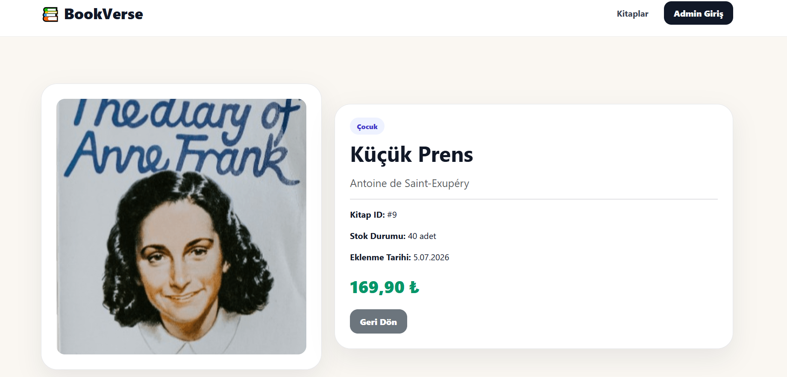
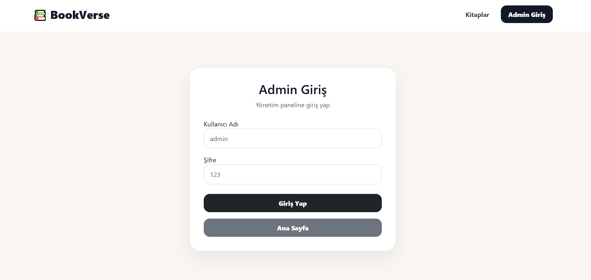
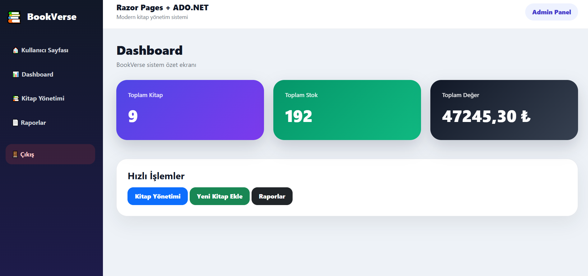
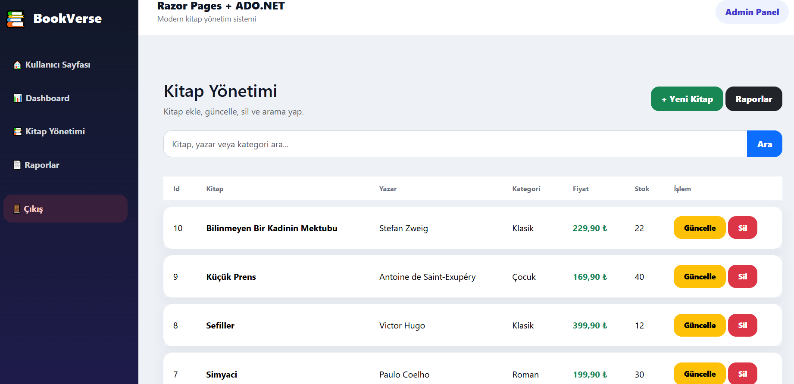
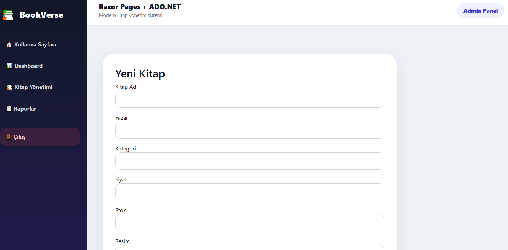
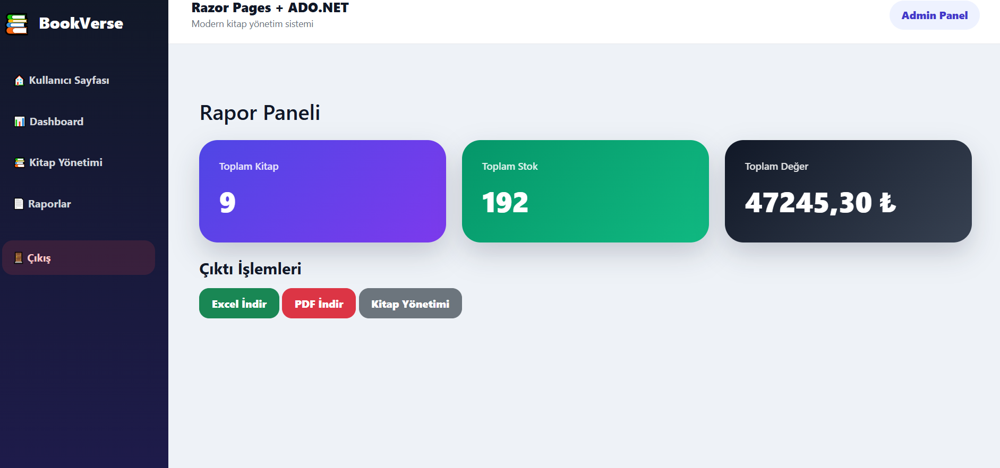

<!-- HEADER -->

<div align="center">

# 📚 BookVerse

### Modern Book Management System with ASP.NET Core Razor Pages & ADO.NET

A modern book management application built using ASP.NET Core Razor Pages, ADO.NET, SQL Server and Bootstrap. The project includes book management, search functionality, reporting dashboard, PDF & Excel export features and an admin panel.

---


</div>

---

# 📸 Project Screenshots

## Home Page


---

## Book Detail



---

## Admin Login



---

## Admin Dashboard



---

## Book Management



---

## Add Book



---

## Reports



---

# 🚀 Project Features

### 👤 Customer Side

* Home Page
* Book Listing
* Book Search
* Book Detail Page
* Responsive Design

---

### 🛠 Admin Panel

* Admin Login
* Dashboard
* Book CRUD
* Search Books
* Reporting
* PDF Export
* Excel Export
* Session Authentication

---

### 📊 Reporting Dashboard

* Total Books
* Total Stock
* Total Inventory Value
* Book Statistics
* Excel Report Export
* PDF Report Export

---

# 🏗 Project Architecture

```text
BookStoreRazorDbFirst

│

└── ASP.NET Core Razor Pages

    ├── ADO.NET

    ├── SQL Server

    ├── Bootstrap 5

    ├── Razor Pages

    ├── Session

    ├── QuestPDF

    ├── ClosedXML

    └── Custom Dashboard
```

---

# 🛠 Technologies

| Backend                  | Frontend    | Database    | Other     |
| ------------------------ | ----------- | ----------- | --------- |
| ASP.NET Core Razor Pages | Bootstrap 5 | SQL Server  | ADO.NET   |
| C#                       | HTML5       | DB First    | Session   |
| Razor Pages              | CSS3        | Stored Data | QuestPDF  |
| CRUD Operations          | JavaScript  |             | ClosedXML |

---

# 📊 Modules

✔ Home Page

✔ Book Listing

✔ Book Detail

✔ Admin Login

✔ Dashboard

✔ Book Management

✔ Book Search

✔ Add Book

✔ Edit Book

✔ Delete Book

✔ Reporting Dashboard

✔ PDF Report Export

✔ Excel Report Export

✔ Session Authentication

✔ Responsive Design

---

# 📂 Database Tables

| Table  |
| ------ |
| Books  |
| Admins |

---

# 🎯 Learning Outcomes

* ASP.NET Core Razor Pages
* ADO.NET
* SQL Server
* DB First Approach
* CRUD Operations
* Session Management
* Search Operations
* Dashboard Design
* PDF Report Generation
* Excel Report Generation
* Responsive Web Design

---

# ⭐ Project Status

✅ Completed

---

<div align="center">

Made with ❤️ using ASP.NET Core Razor Pages & ADO.NET

</div>
